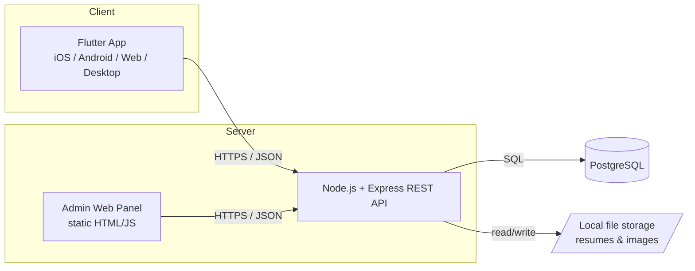
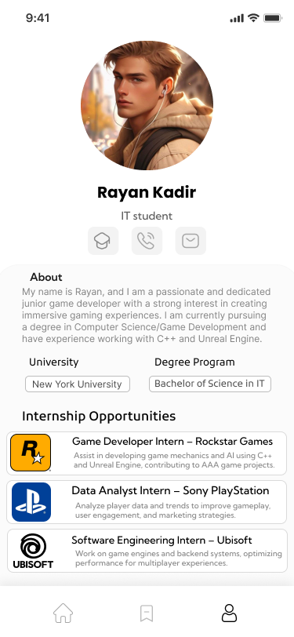
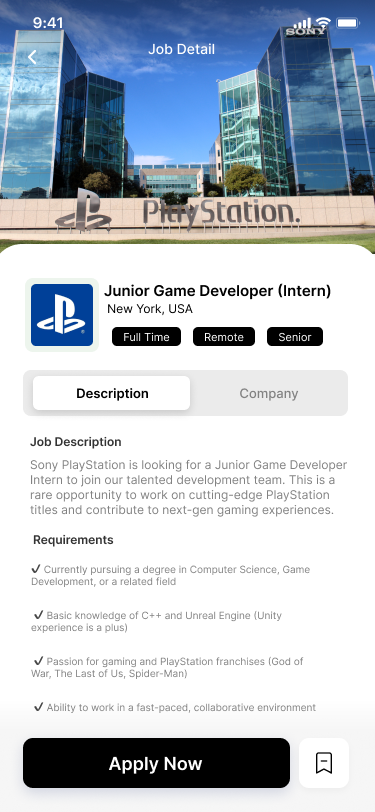
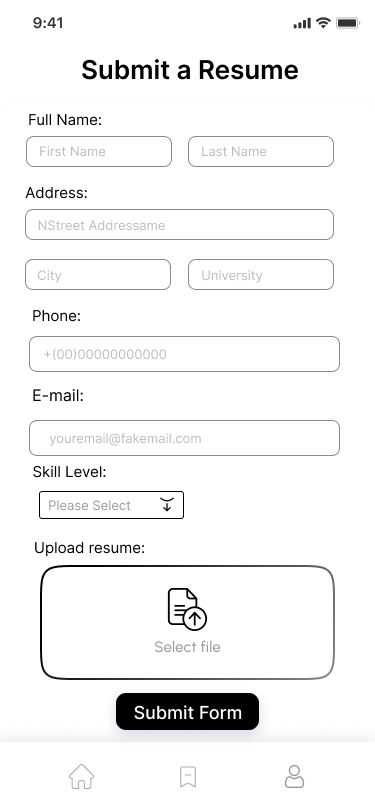
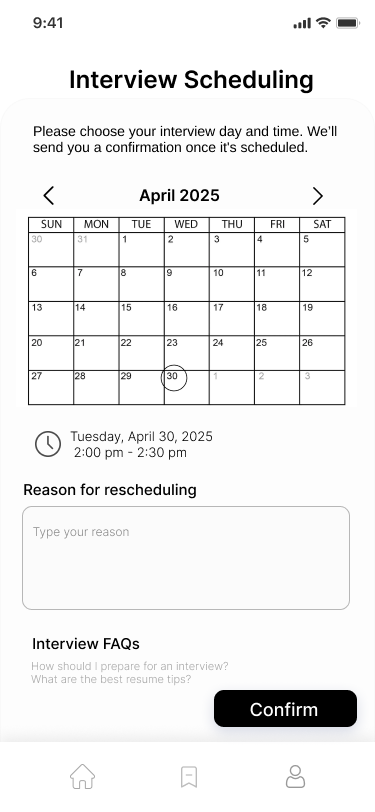

# 🎓 Career Services Portal

A full-stack internship & career services platform: a Flutter mobile/web app for students to browse internships, apply with a resume, and schedule interviews — backed by a Node.js/Express REST API, PostgreSQL database, and a built-in admin web panel for managing job postings.


---

## 📱 Overview

Career Services Portal is a self-contained MVP that models a real university career-services product: students register, browse internships from companies like Rockstar Games, Sony PlayStation, and Ubisoft, save the ones they're interested in, submit a resume, and book an interview slot — all backed by a real database and a real REST API, not mock data.

Built end-to-end — client, server, database schema, and an internal admin tool — as a full-stack learning project.

## ✨ Features

**For students (Flutter app)**
- Register / log in with JWT-based auth
- Browse and search internship listings
- Save/bookmark jobs
- Submit a resume application with real file upload (PDF/DOC/DOCX)
- Schedule an interview from an interactive calendar
- Edit profile, including a real profile photo upload

**For admins (web panel)**
- Live dashboard of user/job/application/interview counts
- Add, edit, and delete job postings — including a cover image
- Browse every registered student, submitted application (with a direct link to the uploaded resume), and scheduled interview

## 🏗️ Architecture



The Flutter app and the admin panel are two independent clients of the same REST API — neither talks to the database directly.

## 🛠️ Tech Stack

| Layer | Technology |
|---|---|
| Mobile/Web client | Flutter, Dart |
| Backend | Node.js, Express |
| Database | PostgreSQL |
| Auth | JWT (jsonwebtoken) + bcrypt password hashing |
| File uploads | Multer (multipart/form-data) |
| Admin panel | Vanilla HTML/CSS/JS (no framework, no build step) |

## 📂 Project Structure

```
career-services-portal/
├── app/                    # Flutter client
│   ├── lib/
│   │   ├── models/         # Job, AppUser — plain data classes
│   │   ├── services/       # ApiClient + one service per resource
│   │   ├── state/          # AppState (session + job list)
│   │   ├── screens/        # One file per screen
│   │   └── widgets/        # Shared UI components
│   └── README.md           # Flutter-specific setup
│
├── backend/                 # REST API
│   ├── src/
│   │   ├── db/              # Connection pool, schema, migration script
│   │   ├── repositories/    # All SQL lives here, one file per table
│   │   ├── middleware/      # JWT auth, admin key, image upload
│   │   └── routes/          # Express routes
│   ├── public/admin/        # The admin web panel
│   └── README.md            # Backend-specific setup + full API reference
│
└── README.md                 # You are here
```

## 🚀 Getting Started

Both halves have their own detailed setup guide — start with the backend, then the app:

1. **[Backend setup](./backend/README.md)** — install PostgreSQL, configure `.env`, run migrations, start the API and admin panel
2. **[Flutter app setup](./app/README.md)** — install dependencies, point it at your running backend, run it

Quick version, once PostgreSQL is installed:

```bash
# 1. Backend
cd backend
npm install
cp .env.example .env        # then edit .env with your DB credentials
npm run migrate
npm start                    # → http://localhost:3000, admin at /admin

# 2. Flutter app (separate terminal)
cd app
flutter pub get
flutter create .              # first time only — generates platform folders
flutter run -d chrome
```

## 📸 Screenshots

| Student Dashboard | Job Detail |
|---|---|
|  |  |

| Resume Submission | Interview Scheduling |
|---|---|
|  |  |

## 🗺️ Roadmap

Deliberately left for a future pass — an honest list, not a todo I'm hiding:

- [ ] Deploy a live demo (currently local-only by design)
- [ ] Replace the admin panel's shared-secret key with real admin accounts + sessions
- [ ] Email notifications when an application is submitted
- [ ] Automated tests (unit + widget + API)
- [ ] Token refresh / expiry handling in the Flutter app

## 📄 License

Distributed under the MIT License. See [`LICENSE`](./LICENSE) for details.

## 👤 Author

**Your Name**
[GitHub](https://github.com/javohir-io) 

Built as a full-stack portfolio project — Flutter frontend, Node/Express backend, PostgreSQL database, and an admin panel, all designed and wired together end to end.
